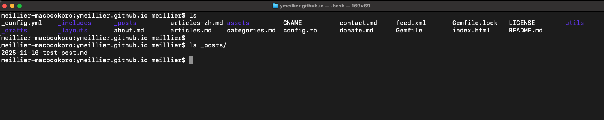

This page is just a test markdown to test the workflow of using github as a blogging site. 
	- Source:  https://github.com/ArthurChiao/arthurchiao.github.io
	- See also: https://github.com/chadbaldwin/simple-blog-bootstrap

Blog hosted on: https://github.com/ymeillier/ymeillier.github.io

local repo: 
```bash
Users/meillier/Documents/07-git/01-gitblog/ymeillier.github.io
```




Preview via cli: 
```bash
cd ymeillier.github.io
bundle exec jekyll serve --drafts --incremental
```

Visit `localhost:4000` with your browser:
```bash
open -a "Google Chrome" http://localhost:4000
```